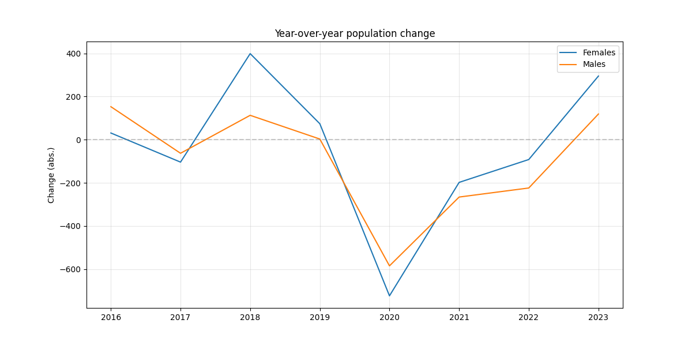

# Demographic Shifts & Workforce Aging in Aruba (2015–2023)  
   
This project explores structural demographic changes in Aruba between 2015 and 2023, with a specific focus on workforce aging and its broader societal implications.  
   
## Results / Key Findings

- Aruba’s total population increased through 2019, declined sharply from 2020 onward, and showed a modest recovery in 2023.
- The most severe contraction appears in 2020, making it a clear turning point in the series.
- Year-over-year population change suggests that female population change was more volatile than male change over the period shown.

<p align="center">
  
  
</p>

<p align="center">
  <em>Figures 1 and 2: Total population trend and annual population change rate.</em>
</p>

<p align="center">
  
</p>

<p align="center">
  <em>Figure 3. Year-over-year population change by sex.</em>
</p>

---

## Project Overview

**Motivation**  
My interest in this project is rooted in a desire to contribute to the long-term wellbeing of Aruba as a nation.  
Rather than focusing on commercial analytics or short-term business metrics, this work centers on population structure, workforce sustainability, and potential systemic pressures that may shape daily life in Aruba over the coming decades.  
By analyzing official datasets from the Central Bureau of Statistics (CBS), this project seeks to:  
- Identify trends in working-age population structure  
- Measure changes in age distribution over time  
- Explore aging-related dependency ratios  
- Examine connections between demographic shifts and potential healthcare or labor pressures  
This project is driven by curiosity, civic responsibility, and a commitment to evidence-based thinking.  


**Data Sources**  
Primary datasets include:  
- Age distribution of the end-of-year population  
- Live births by age of mother  
- Teenage motherhood statistics  
- Life expectancy by age and sex  
- Country of birth (domiciliation data)  
- (Planned) Hospitalization data by age group  
All data originates from the [Central Bureau of Statistics Aruba](https://cbs.aw)


**Approach**  
The analysis will proceed in structured phases:  
1. Exploratory Data Analysis (EDA) in Google Sheets for pattern recognition  
2. Data transformation (wide → long format) for analytical flexibility  
3. Construction of a unified panel dataset (Year × Age Group)  
4. Calculation of structural indicators such as:  
- Workforce composition  
- Old-age dependency ratio  
- Age cohort shifts  
- Hospitalization rates per 1,000 population (planned) 

The goal is not to generate flashy dashboards, but to build a clear, reproducible, and policy-relevant analysis.  


**Guiding Question**  
What demographic patterns in Aruba between 2015 and 2023 may signal long-term structural pressure on the workforce and healthcare system?  


**Status**  
Currently in the exploratory phase.  
Data cleaning, reshaping, and structural indicator calculations in progress.  


## Stack

- Excel/Google Sheets
- Python
- pandas (matplotlib, numpy, seaborn)
- Jupyter Notebook / JupyterLab
- Git/GitHub


## Project Structure

```text
cbs_aruba/
├── config
│   └── __pycache__
├── data
│   ├── processed
│   └── raw
├── notebooks
├── outputs
│   ├── db_files
│   ├── figures
│   └── tables
├── scripts
└── src


---

## How to Run

1. Clone the repository
2. Open the notebook in Jupyter
3. Install required packages
4. Run notebooks sequentially
