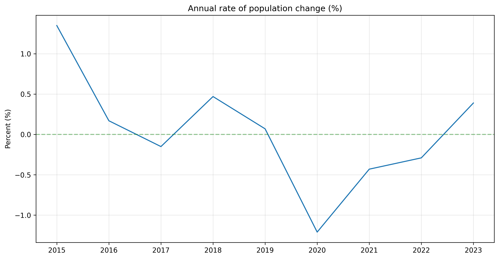

# Demographic Shifts & Workforce Aging in Aruba (2015–2023)  
   
This project explores structural demographic changes in Aruba between 2015 and 2023, with a specific focus on workforce aging and its broader societal implications.  
   
## Results / Key Findings

- Aruba's total population increased through 2019, declined sharply from 2020 onward, and showed a modest recovery in 2023.
- The most severe contraction appears in 2020, making it a clear turning point in the series.
- Year-over-year population change suggests that female population change was more volatile than male change over the period shown.

<p align="center">
  
  
</p>

<p align="center">
  <em>Figures 1 and 2: Total population trend and annual population change rate.</em>
</p>

<p align="center">
  
</p>

<p align="center">
  <em>Figure 3. Year-over-year population change by sex.</em>
</p>

---

## Project Overview

**Motivation**  
My interest in this project is rooted in a desire to contribute to the long-term wellbeing of Aruba as a nation.  
Rather than focusing on commercial analytics or short-term business metrics, this work centers on population structure, workforce sustainability, and potential systemic pressures that may shape daily life in Aruba over the coming decades.  
By analyzing official datasets from the Central Bureau of Statistics (CBS), this project seeks to:  
- Identify trends in working-age population structure  
- Measure changes in age distribution over time  
- Explore aging-related dependency ratios  
- Examine connections between demographic shifts and potential healthcare or labor pressures  
This project is driven by curiosity, civic responsibility, and a commitment to evidence-based thinking.  


**Approach**  
The analysis will proceed in structured phases:  
1. Exploratory Data Analysis (EDA) in Google Sheets for pattern recognition  
2. Data transformation (wide → long format) for analytical flexibility  
3. Construction of a unified panel dataset (Year × Age Group)  
4. Calculation of structural indicators such as:  
- Workforce composition  
- Old-age dependency ratio  
- Age cohort shifts  
- Hospitalization rates per 1,000 population (planned) 

The goal is not to generate flashy dashboards, but to build a clear, reproducible, and policy-relevant analysis.  


## Data Sources

Primary datasets include:  
- Age distribution of the end-of-year population  
- Live births by age of mother  
- Teenage motherhood statistics  
- Life expectancy by age and sex  
- Country of birth (domiciliation and departures data)  
- (Planned) Hospitalization data by age group  
All data originates from the [Central Bureau of Statistics Aruba](https://cbs.aw)


## Guiding Question

What demographic patterns in Aruba between 2015 and 2023 may signal long-term structural pressure on the workforce and healthcare system?  


## Project Status

Three tables are fully migrated, validated, and published: population change/density, domiciliation, and departures — each with a real reconciliation check confirming the persisted data is correct, not just that the code ran. A cross-table analysis (net domiciliation balance by country) has been built and shared. Remaining tables (age distribution, life expectancy, births, unemployment, etc.) are still being migrated one at a time.


## Stack

- Python (pandas, Polars) in VS Code
- DuckDB / parquet
- Jupyter Notebook / JupyterLab
- Google Sheets (informal, quick-look exploration only — not part of the pipeline)
- Git / GitHub


## Project Structure

```text
cbs_aruba/
├── .github/
│   └── workflows/
├── config
├── data
│   ├── external
│   ├── processed
│   ├── raw
│   └── README.md
├── environment.yml
├── LICENSE
├── Makefile
├── notebooks
│   ├── analysis
│   ├── eda
│   └── load
├── outputs
│   ├── db_files
│   ├── figures
│   └── tables
├── scripts
├── src
└── tests
```


---

## Reproducibility

Raw source files are tracked in Git for reproducibility, since CBS Aruba source links can be removed or replaced without notice. Processed data files are not tracked — they're regenerated from raw sources via each table's load step. See `data/README.md` for the full file listing and per-file provenance.

Create the Conda environment from `environment.yml`:

```bash
conda env create -f environment.yml
conda activate aruba-population-analysis
```

Update an existing environment after dependency changes:

```bash
conda env update -f environment.yml --prune
```

### Running the pipeline

Tables are being migrated from notebooks to standalone scripts one at a time. Converted tables (`scripts/`) run via `python scripts/load_<table>.py` and include a full validation + smoke test on every run. Tables not yet converted still have a load step under `notebooks/load/`. See `data/README.md` for which tables are in which state. A single unified entry point (`scripts/run_all.py`) is planned once all load steps are converted and stable.

## Local Development Workflow

Common local checks are available through the Makefile:

```bash
make compile
```

- `make compile` compiles Python files in `config`, `src`, and `scripts`.

Each converted load script includes its own validation (checking that reshaped data reconciles against reported totals) and a smoke test (re-querying the persisted DuckDB table to confirm it matches). A project-wide fixture-based test suite is a future possibility once more tables are converted.

## Continuous Integration

The CI workflow creates the Conda environment from `environment.yml`,
verifies that core dependencies import correctly, and compiles the Python
modules in `config`, `src`, and `scripts` to catch syntax errors early.
